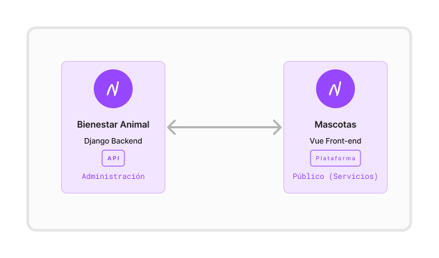
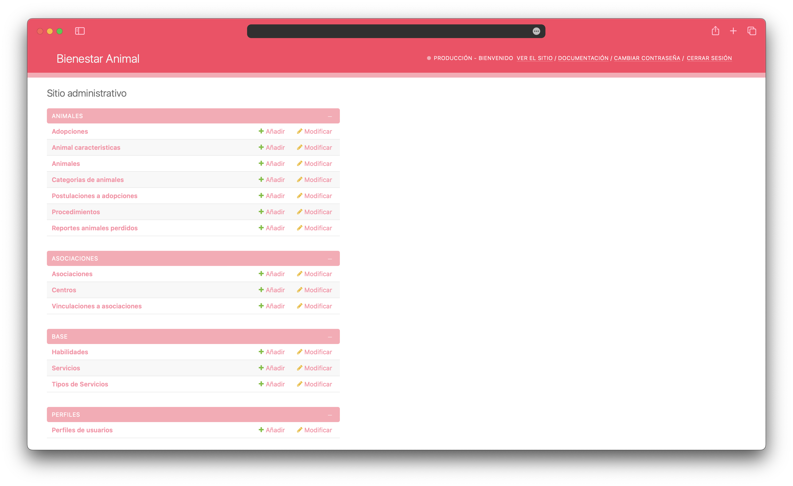
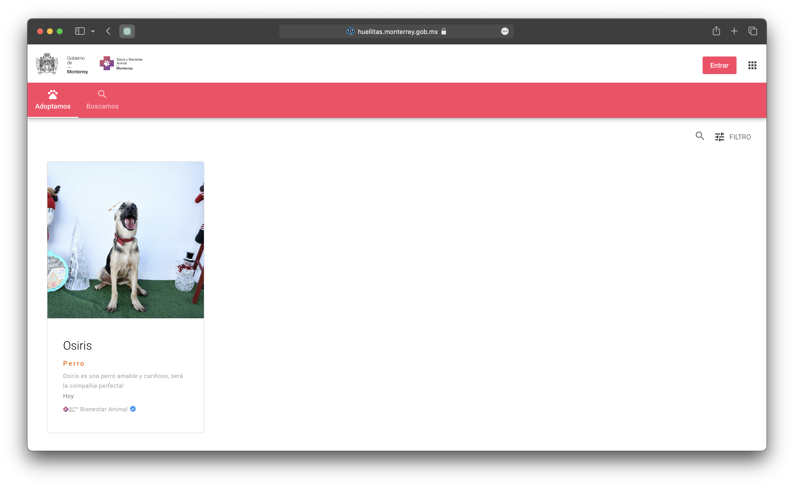

# Plataforma de Bienestar Animal

La Plataforma de Bienestar Animal ofrece una serie de herramientas digitales diseñadas para facilitar la gestión de los animales en los centros de Bienestar Animal en Monterrey. Esta plataforma proporciona soluciones para monitorear a los animales alojados en estos centros, además de facilitar la coordinación de adopciones, gestión de reportes de animales perdidos y el registro de actividades veterinarias. Su objetivo es optimizar la operatividad de los refugios y promover el bienestar animal en la comunidad, garantizando un entorno más seguro y saludable para todos los seres vivos involucrados.

# Arquitectura



La plataforma está compuesta por dos componentes principales: el backend y el frontend. El backend está desarrollado en Python utilizando Django y con un diseño API First. El frontend está desarrollado en Vue.js utilizando el framework Quasar.

Actualmente, la plataforma cuenta con las siguientes funcionalidades:

- Registro de animales
- Registro de actividades veterinarias
- Registro de reportes de animales perdidos
- Registro de adopciones

Adicionalmente se ha desarrollado una SPA (Single Page Application) que permite visualizar los animales en adopción en la plataforma así como los reportes de animales perdidos.

# Instalación (Backend)



Para instalar la plataforma, se requiere tener instalado [Python](https://www.python.org/downloads/) y [pip](https://pip.pypa.io/en/stable/installing/). Se recomienda utilizar un entorno virtual para instalar las dependencias del proyecto. Para crear un entorno virtual, se puede utilizar el siguiente comando:

```bash
python -m venv venv
```

Para activar el entorno virtual, se puede utilizar el siguiente comando:

```bash
source venv/bin/activate
```

Una vez activado el entorno virtual, se pueden instalar las dependencias del proyecto utilizando el siguiente comando:

```bash
pip install -r requirements.txt
```

## Uso

#### Dev

Para ejecutar la plataforma, se debe utilizar el siguiente comando:

```bash
python manage.py runserver
```

#### Production

Para ejecutar la plataform en producción se debe utilizar Gunicorn.

```bash
gunicorn wsgi:app
```

# Instalación (Frontend)



Para instalar la plataforma, se requiere tener instalado [Node.js](https://nodejs.org/en/download/) y [npm](https://www.npmjs.com/get-npm). Una vez instalados, se debe ejecutar el siguiente comando para instalar las dependencias del proyecto:

```bash
npm install
```

## Uso

Para ejecutar la plataforma, se debe utilizar el siguiente comando:

```bash
quasar dev
```

Para compilar la plataforma, se debe utilizar el siguiente comando:

```bash
quasar build
```

## Despliegue

Para desplegar la plataforma cualquier servicio de hosting o en un servidor propio, se debe compilar la plataforma y copiar los archivos generados en la carpeta `dist/spa` en el servidor.

# Contribución

Para contribuir al proyecto, se debe crear un fork del repositorio y clonarlo en su computadora. Una vez hecho esto, se debe crear una rama con el nombre de la funcionalidad que se desea agregar. Una vez terminada la funcionalidad, se debe crear un pull request a la rama `master` del repositorio original.


